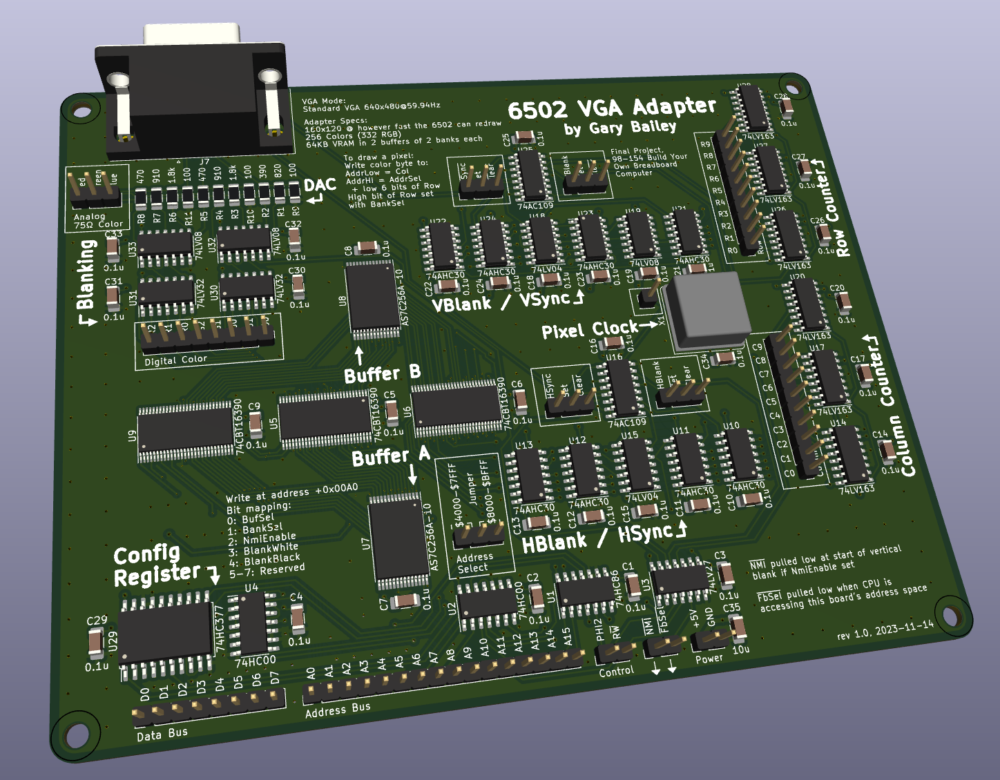
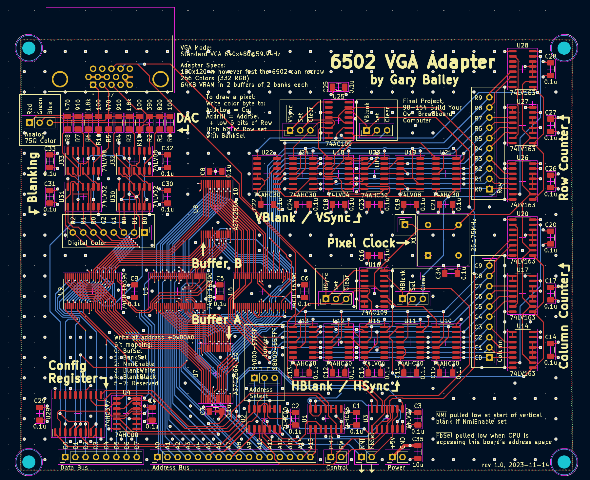
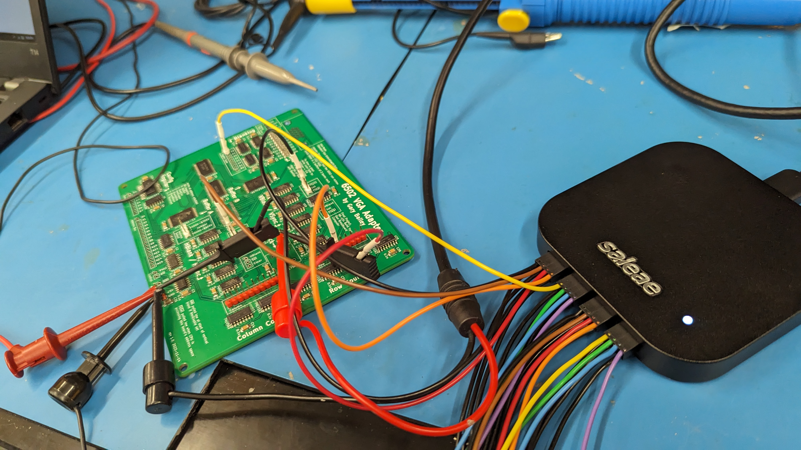
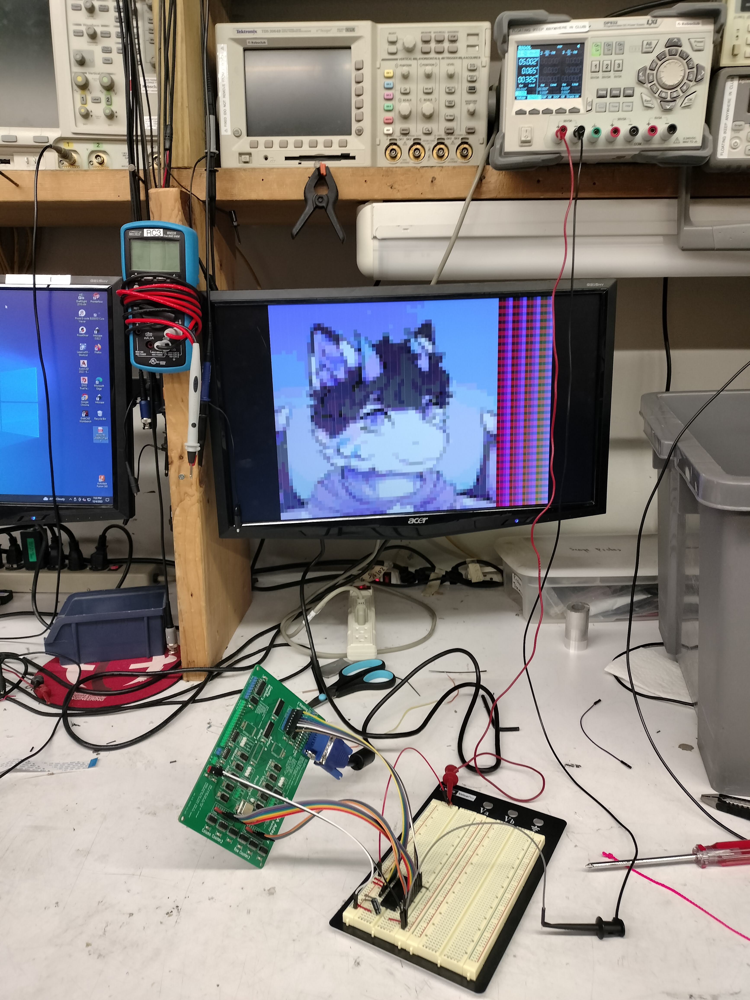
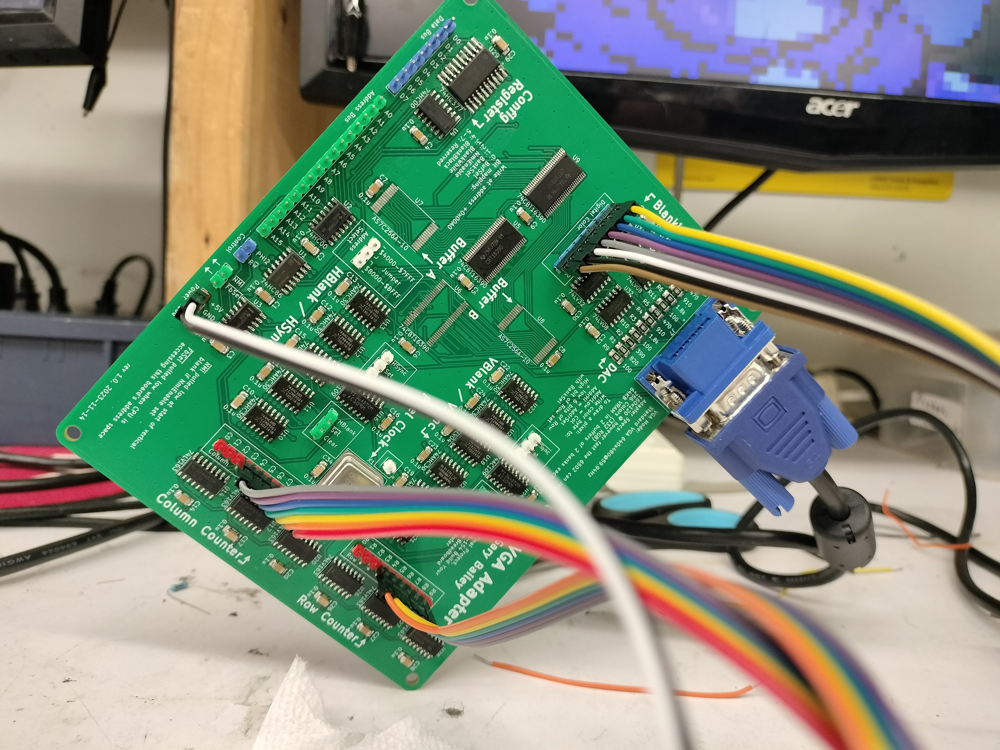
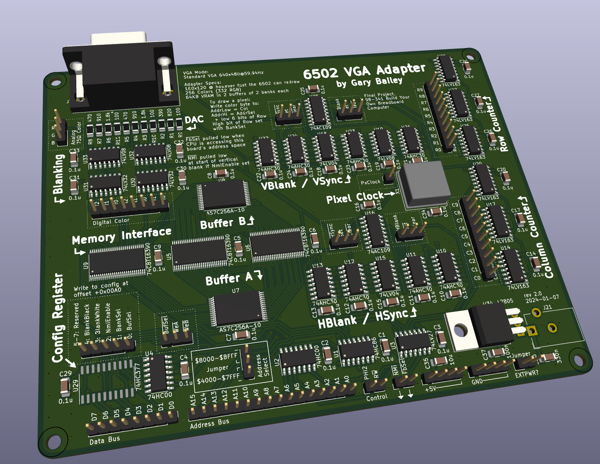
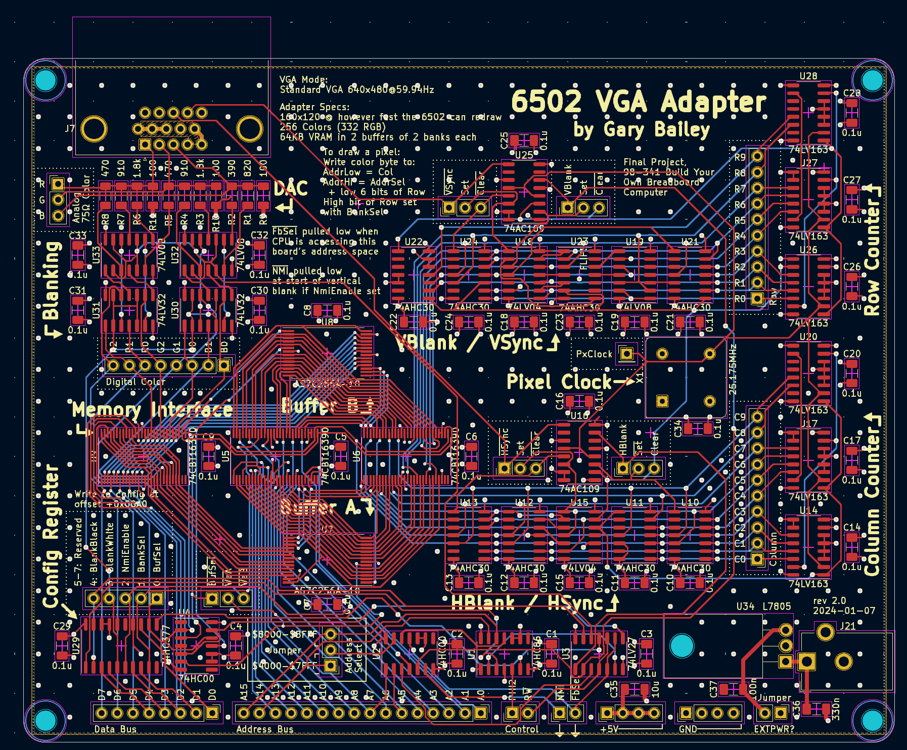
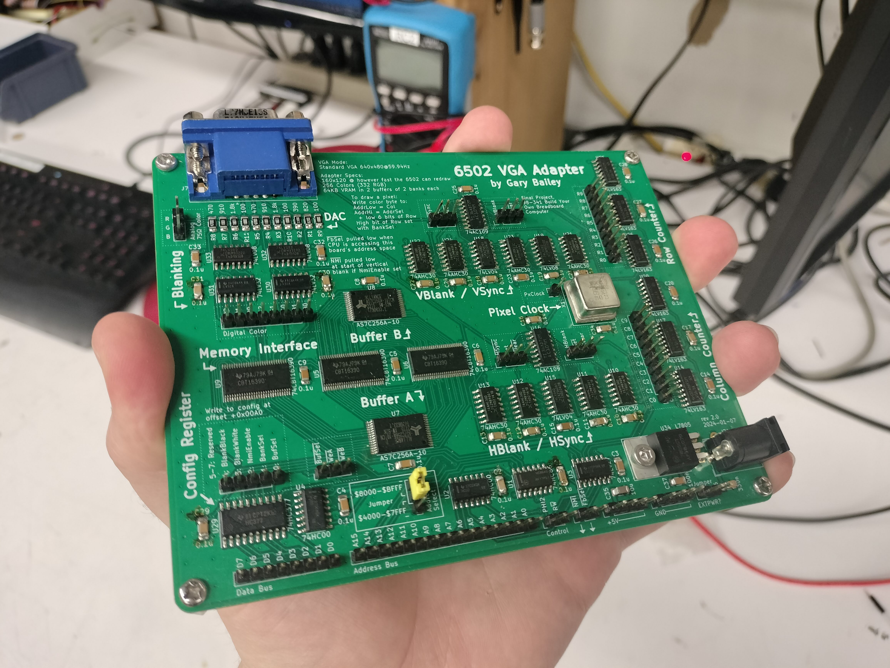
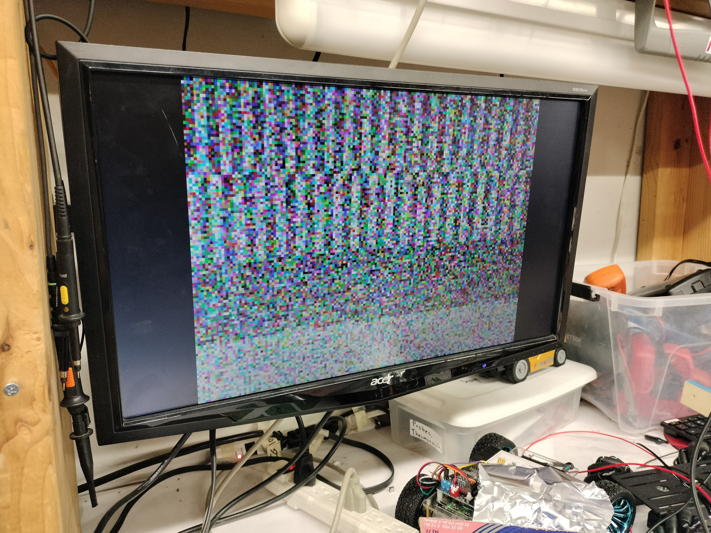
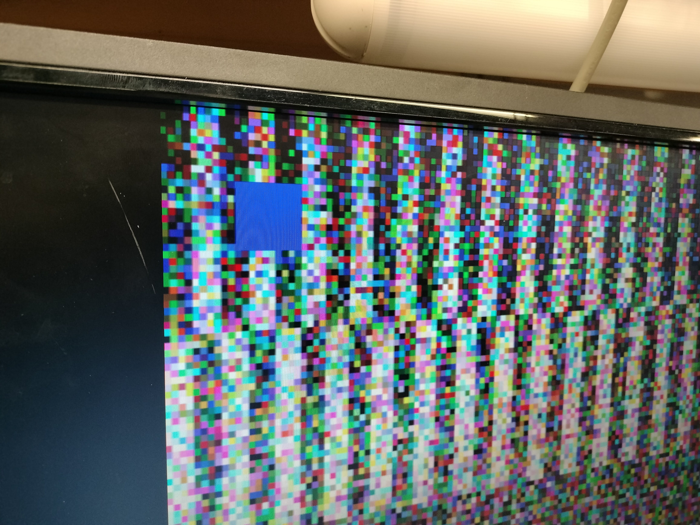

# 6502 Framebuffer
A 160 by 120 pixel, 256-color framebuffer and VGA generator for a 6502-based computer, made
for CMU 98-341 Build Your Own Breadboard Computer.

Heavily inspired by Ben Eater's "[world's worst video
card](https://www.youtube.com/watch?v=l7rce6IQDWs)" saga, but with many
improvements:
- better timing compliance (shorter critical path -> no vertical artifacts)
- FFs instead of latches (easier to debug timing)
- higher resolution (160x120 vs. 100x75), accomplished through memory banking
- more common VGA mode (640x480 vs. 800x600)
- double-bufferring (updates aren't restricted to blanking period)
- software blanking (show solid black or white without drawing to every pixel)
- configurability (disable NMI if not needed)

This repo contains the KiCad files for the board, a corresponding Verilog
design and testbench, and a software simulator.

The board went through 2 revisions before it worked fully:

## Rev1
Revision 1 worked well enough to generate a valid VGA signal, but I made a major
mistake on the SRAM pinout which led to it not being able to interface with the
6502 computer. Another mistake: my minimum via diameter was too small, so it
cost like $40 extra...

However, despite these faults, I was able to bodge the row and column pins to
allow it to display an image from an EEPROM.

KiCad render

KiCad board view

 Part of the arduous debugging
process that eventually led to me discovering the SRAM mistake...

 It works! (with a static image...) The
EEPROM I used here has a much slower read speed than the SRAMs I designed for,
which leads to the vertial artifacts on some pixels here.

Closeup of Rev1 bodges: SRAMs removed and row/column signals routed to EEPROM + color routed in through header

## Rev2
Revision 2 fixed the pinout of the SRAM ICs, fixed the via size issue, added a
debug header for the config register, and added an optional 5V regulator that
can be used to power the entire computer.

KiCad render

KiCad board view

Final assembled board!

Power-on noise: this is expected! The SRAM does not have a deterministic state when powered on.

Drawing to the screen works!

And it can redraw live!